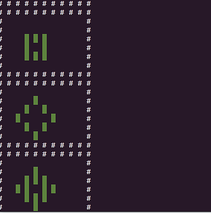
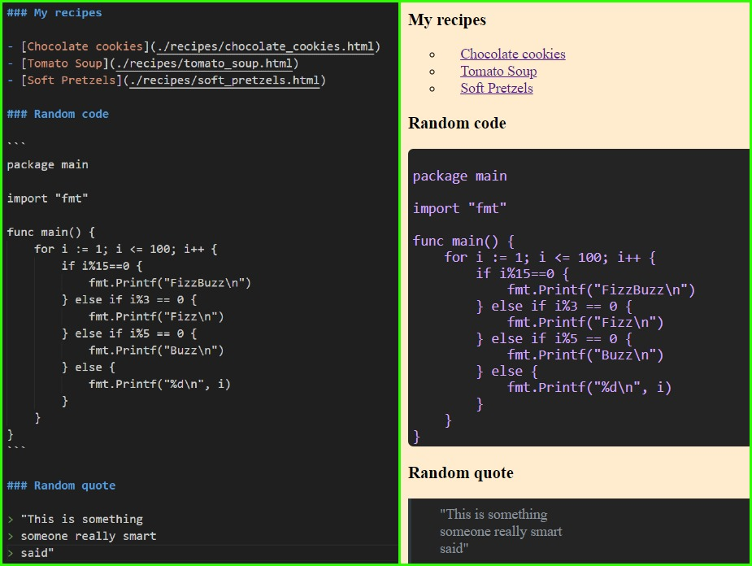

# Small Projects I do in my free time
Basically some of the stuff that I want to archive, but they aren't worth a seperate repository.

---
## Table of contents <!-- hack: - is for a space character, use all lowercase-->
C++:
* [Product Inventory Project](#product-inventory-project)

Python:
* [Game Of Life](#game-of-life)
* [Markdown to HTML static site generator](#static-site-generator)

---
## Product Inventory Project
[code](https://github.com/arturJan4/SmallProjects/tree/master/ProductInventoryProject)  

>*Create an application which manages an inventory of products.  
>Create a product class which has a price, id, and quantity on hand.  
>Then create an inventory class which keeps track of various products and can sum up the inventory value.*

[idea from here](https://github.com/karan/Projects#classes)  

---
## Game Of Life
    
[code](https://github.com/arturJan4/SmallProjects/tree/master/Conway)  

Simple Conway's Game of Life using terminal **(colorama FTW!)** graphics
1. Infite loop to simulate a board given as a 2d array of ones and zeros directly in the code, or in the file *toad.txt*.
2. Can generate random boards of given size and simulate them.
3. Unit tested.

## Static Site Generator
    
[code](https://github.com/arturJan4/SmallProjects/tree/master/StaticSiteGenerator)  

1. Generate static HTML pages from provided Markdown files all static elements.
2. Generates sites recursively
3. Unit-tested, type-tested, and linted 