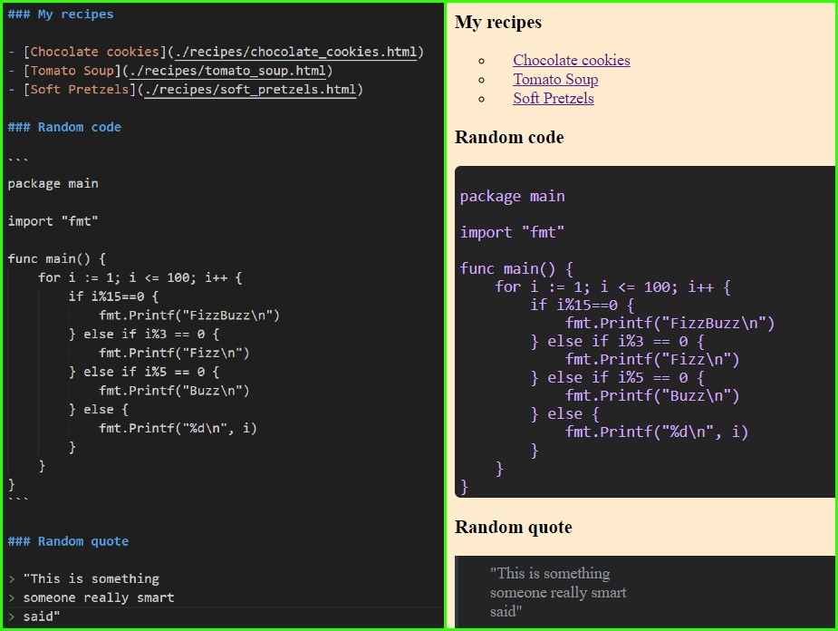

<h3 align="center">Static site generator</h3>

  

    Generate static HTML sites with Python from Markdown templates.
  

<!-- TABLE OF CONTENTS -->

  
Table of Contents

  <ol>
    <li>
      <a href="#about-the-project">About The Project</a>
      <ul>
        <li><a href="#built-with">Built With</a></li>
      </ul>
    </li>
    <li>
      <a href="#getting-started">Getting Started</a>
      <ul>
        <li><a href="#prerequisites">Prerequisites</a></li>
      </ul>
    </li>
    <li><a href="#usage">Usage</a></li>
    <li><a href="#roadmap">Roadmap</a></li>
  </ol>

<!-- ABOUT THE PROJECT -->
## About The Project

Markdown is a lightweight markup language with plain-text formatting syntax, commonly used for creating structured documents, particularly for web content. However, while Markdown is easy to write and read, it requires conversion into HTML for web display.

This is a project that aims to automate that conversion.

(<a href="#readme-top">back to top</a>)

   

### Built With

* Python3.12 only

(<a href="#readme-top">back to top</a>)

<!-- GETTING STARTED -->
## Getting Started

- `./main.sh` runs converter and server
- `./lint.sh` to check and fix formatting (also checks types)
- `./test.sh` run included unit-tests (one should fail if it's working)

### Prerequisites

- **python 3.12** installed

<!-- USAGE EXAMPLES -->
## Usage

1. Place `.md` files into `markdown_page/` folder (or it's subfolders)
2. Place required static elements (images, css etc.) into `static` folder
3. Modify `template.html` inside `markdown_page/` to your liking  
-``{{Title}}`` is where the first header will be inputted  
-``{{Content}}`` is the rest of markdown page  
4. Run `main.sh` to generate pages.
5. Pages are served by the server on `localhost:8888`

(<a href="#readme-top">back to top</a>)

<!-- ROADMAP -->
## Roadmap

- [ ] Support for classes and id's for easier styling
- [ ] Add alternative headings
- [ ] Add escape characters
    - [ ] Starting unordered lists with numbers
- [ ] Add horizontal rules
- [ ] Add nested operations
    - [ ] Nested markdown syntax (e.g. `**_really important_**`)
    - [ ] Nested quoteblocks with other elements
    - [ ] Nested lists

(<a href="#readme-top">back to top</a>)

